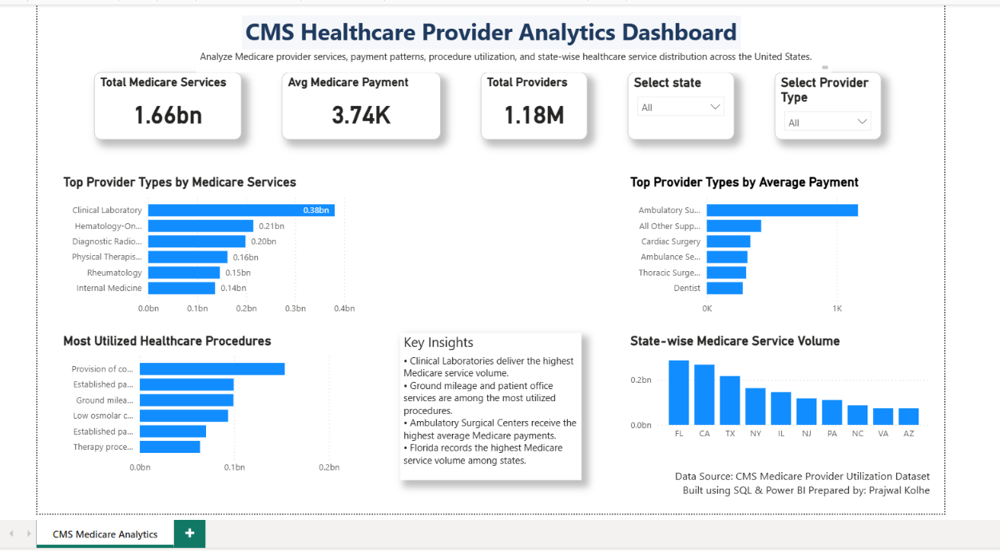

# CMS Healthcare Provider Analytics Dashboard

## Project Overview

This project presents a comprehensive Healthcare Provider Analytics Dashboard built using Power BI, SQL, and healthcare utilization data from the Centers for Medicare & Medicaid Services (CMS).

The objective of this project is to analyze Medicare provider utilization patterns, identify high-performing provider categories, evaluate payment trends, and compare healthcare service distribution across different U.S. states.

---

## Business Problem

Healthcare organizations and policymakers require data-driven insights to understand:

* Which provider categories deliver the highest Medicare service volume
* Which procedures are most frequently utilized
* Which provider types receive the highest average Medicare payments
* How healthcare services are distributed geographically across states

This dashboard transforms raw CMS healthcare data into actionable business intelligence for healthcare decision-makers.

---

## Tools & Technologies

* Power BI
* SQL
* Microsoft Excel
* Healthcare Analytics
* Data Visualization
* Business Intelligence Reporting

---

## Dataset

Source: CMS Medicare Provider Utilization Data

The dataset contains healthcare provider information, procedure utilization statistics, Medicare payment metrics, provider participation details, and state-level healthcare service volume.

---

## Dashboard KPIs

| KPI                      | Value        |
| ------------------------ | ------------ |
| Total Medicare Services  | 1.66 Billion |
| Average Medicare Payment | 3.74K        |
| Total Providers          | 1.18 Million |

---

## Dashboard Components

### 1. Top Provider Types by Medicare Services

Analyzes provider categories generating the highest Medicare service volume.

Key Finding:
Clinical Laboratories account for the highest Medicare service utilization among all provider categories.

---

### 2. Most Utilized Healthcare Procedures

Highlights the healthcare procedures most frequently performed within Medicare programs.

Key Finding:
Ground mileage and patient office-related services are among the most utilized healthcare procedures.

---

### 3. Top Provider Types by Average Payment

Compares provider categories based on average Medicare reimbursement.

Key Finding:
Ambulatory Surgical Centers receive the highest average Medicare payments.

---

### 4. State-wise Medicare Service Volume

Visualizes healthcare service utilization across different U.S. states.

Key Finding:
Florida records the highest Medicare service volume among the analyzed states.

---

## Key Insights

* Clinical Laboratories contribute the largest Medicare service volume.
* Procedure utilization is concentrated among a small group of high-demand healthcare services.
* Ambulatory Surgical Centers command significantly higher average Medicare payments compared to other provider categories.
* Healthcare service volume varies considerably across states, with Florida leading overall utilization.
* Provider performance and reimbursement patterns reveal opportunities for healthcare resource optimization.

---

## Skills Demonstrated

### Data Analytics

* Data Exploration
* Data Cleaning
* KPI Development
* Insight Generation

### SQL

* Aggregations
* Filtering
* Group By Analysis
* Healthcare Data Querying

### Power BI

* Interactive Dashboard Development
* KPI Cards
* Slicers & Filters
* Data Visualization
* Dashboard Design

### Healthcare Domain Knowledge

* Medicare Analytics
* Provider Performance Analysis
* Healthcare Utilization Analysis
* Payment Trend Evaluation

---

## Dashboard Preview

Add your dashboard screenshot below:

```text

```

---

## Future Enhancements

* Advanced DAX Measures
* Drill-through Analysis
* Provider Deep-Dive Dashboard
* Interactive Tooltips
* Geographic Map Visualizations
* Predictive Healthcare Analytics

---

## Project Structure

```text
healthcare-analytics-project
│
├── dashboard
│   └── CMS_Healthcare_Provider_Analytics.pbix
│
├── sql_queries
│   └── healthcare_queries.sql
│
├── screenshot
│   └── dashboard_overview.png
│
├── data
│
└── README.md
```

---

## Author

Prajwal Kolhe

Healthcare Analytics | SQL | Python | Power BI | Business Intelligence

LinkedIn: linkedin.com/in/prajwal-kolhe

GitHub: https://github.com/prajwal-k09

---
